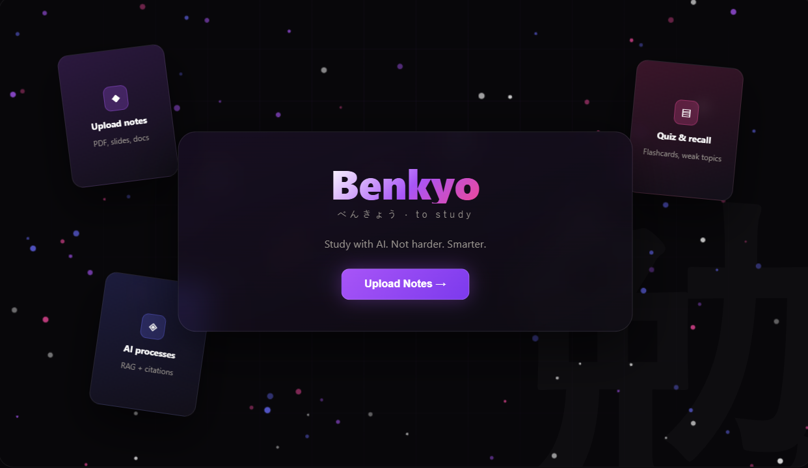
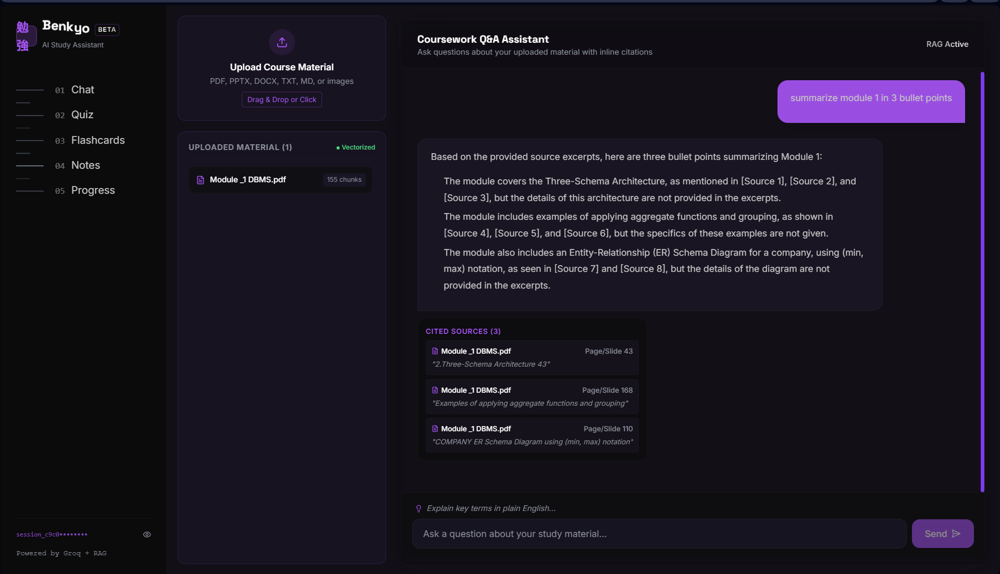
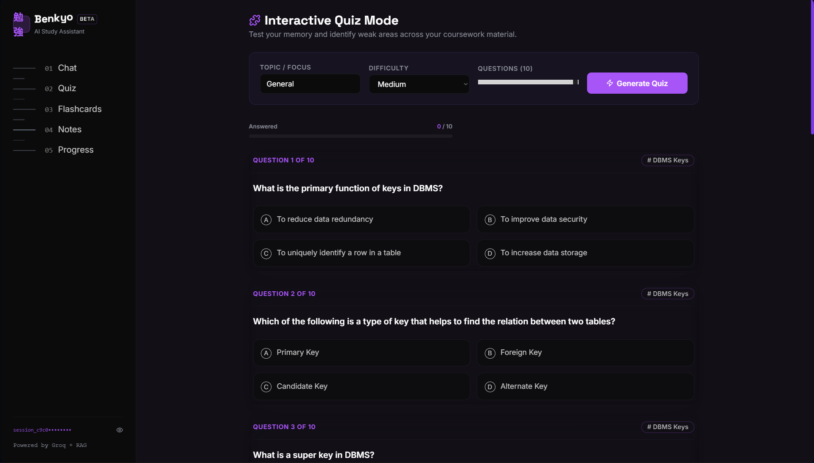
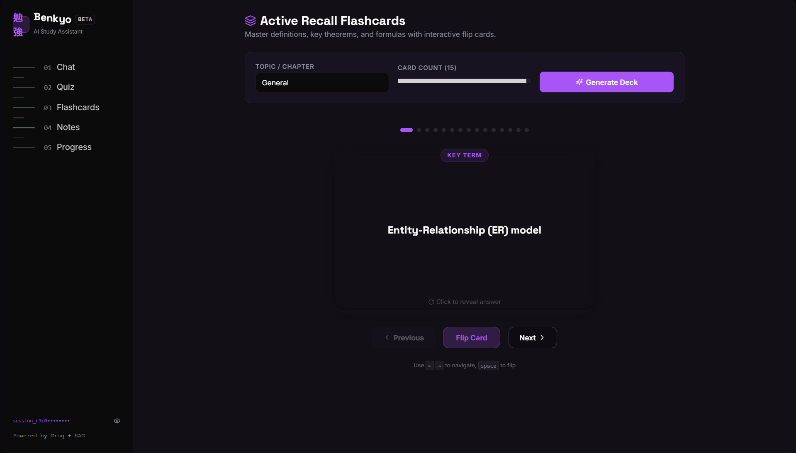
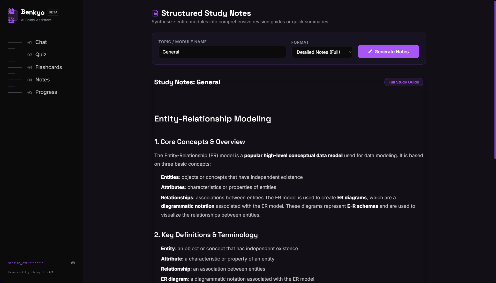
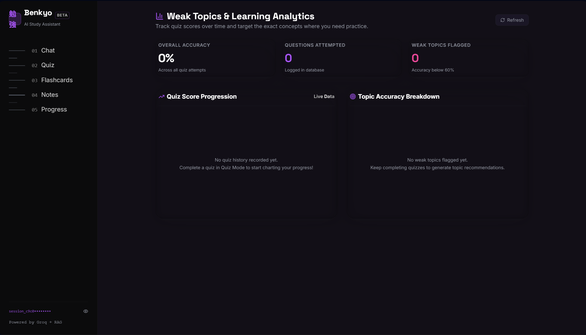
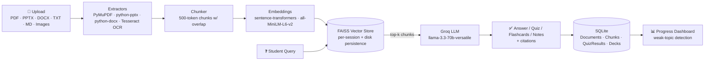

<div align="center">

# 勉強 Benkyo

### Study with AI. Not harder. Smarter.

Upload your coursework. Ask it questions. Quiz yourself. Never forget what you learned.

<p>
  
  
  
  
  
</p>

<p>
  
  
  
</p>

[Features](#-features) •
[Demo](#-demo) •
[Quick Start](#-quick-start) •
[Architecture](#-architecture) •
[Tech Stack](#-tech-stack) •
[Roadmap](#-roadmap)

<br/>



</div>

---

## ✨ Why Benkyo?

Most students end up with the same pile: a hundred PDF slides, a folder of scanned notes, and no time to turn any of it into something they can actually be quizzed on. Benkyo closes that gap — drop in your material, and it becomes a searchable, quizzable, flashcard-able study companion in seconds, powered by retrieval-augmented generation so every answer is traceable back to *your* source, not a hallucination.

## 🚀 Features

<table>
<tr>
<td width="50%" valign="top">

### 💬 Coursework Q&A
Ask anything about your uploaded material. Every answer comes with **inline citations** — filename, page number, and the exact snippet it was pulled from — so you can always verify it yourself.

### 📝 Interactive Quizzes
Auto-generated multiple-choice quizzes with **adjustable difficulty** and **topic tags**, scored instantly so you know where you stand.

</td>
<td width="50%" valign="top">

### 🎴 Active Recall Flashcards
3D flip-card decks generated straight from your notes and slides, built for spaced/active-recall style revision.

### 📊 Weak Topic Analytics
Quiz scores are tracked over time on a live dashboard that automatically flags any topic scoring **below 60% accuracy** for targeted revision.

</td>
</tr>
</table>

### 📚 Structured Study Notes
Turn a messy module into a clean, structured markdown study guide — core concepts, key definitions, and takeaways, generated on demand.

## 🎬 Demo

<div align="center">
<table>
<tr>
<td align="center"><b>Coursework Q&A</b><br/><sub>Grounded answers with inline citations</sub><br/></td>
<td align="center"><b>Interactive Quiz</b><br/><sub>AI-generated MCQs with topic tags</sub><br/></td>
</tr>
<tr>
<td align="center"><b>Active Recall Flashcards</b><br/><sub>3D flip-card decks</sub><br/></td>
<td align="center"><b>Structured Study Notes</b><br/><sub>Generated markdown study guides</sub><br/></td>
</tr>
<tr>
<td align="center" colspan="2"><b>Weak Topic Analytics</b><br/><sub>Track accuracy over time, spot weak spots</sub><br/></td>
</tr>
</table>

<sub>📌 Screenshots live in <code>docs/screenshots/</code>. Replace them with your own build any time — just keep the same filenames and they'll update here automatically.</sub>
</div>

## 🏗 Architecture



Benkyo follows a classic **RAG (Retrieval-Augmented Generation)** pipeline: your documents are parsed, chunked, embedded, and indexed once — then every feature (Q&A, quizzes, flashcards, notes) retrieves the most relevant chunks and asks the LLM to generate grounded output from them, so nothing is made up out of thin air.

## ⚡ Quick Start

<details open>
<summary><b>1. Backend Setup</b></summary>

```bash
cd backend

# Configure your Groq API key
cp .env.example .env
# then edit .env → GROQ_API_KEY=your_groq_key_here

# Install dependencies
python -m pip install -r requirements.txt

# Launch the API
uvicorn main:app --reload --port 8000
```

📖 Interactive API docs: **http://localhost:8000/docs**

</details>

<details open>
<summary><b>2. Frontend Setup</b></summary>

```bash
cd frontend

npm install
npm run dev
```

🌐 App running at: **http://localhost:5173**

</details>

> **Tip:** Run both servers in separate terminals, then open the frontend URL and upload your first file from the landing page.

## 🧰 Tech Stack

| Layer | Stack |
|---|---|
| **Backend** | FastAPI · SQLAlchemy (SQLite) · PyMuPDF (`fitz`) · `python-pptx` · `python-docx` · `pytesseract` |
| **Vector Store & Embeddings** | FAISS (per-session, disk-persisted) · `sentence-transformers` (`all-MiniLM-L6-v2`) |
| **LLM** | Groq API — `llama-3.3-70b-versatile` (text/RAG) · `whisper-large-v3` (voice input) |
| **Frontend** | React (Vite) · Tailwind CSS · `recharts` · `react-markdown` |
| **Custom UI Library** | GlassSurface (SVG displacement) · Particles (WebGL) · LineSidebar · StarBorder · ClickSpark · ShinyText · DecryptText · WaveText · GradientText · BlurText · SplitText · TypewriterText |

## 📂 Project Structure

```
Benkyo/
├── backend/
│   ├── main.py                 # FastAPI entrypoint & CORS setup
│   ├── database.py             # SQLite engine & session setup
│   ├── models.py               # ORM models (Document, Chunk, QuizResult, FlashcardDeck)
│   ├── requirements.txt
│   ├── routers/
│   │   ├── upload.py           # Multi-format upload + extraction + vector indexing
│   │   ├── chat.py             # RAG Q&A endpoint with citations
│   │   ├── quiz.py             # MCQ quiz generation & scoring
│   │   ├── flashcards.py       # Flashcard deck generation
│   │   ├── notes.py            # Structured study notes & summaries
│   │   └── progress.py         # Weak topics & stats tracking
│   └── services/
│       ├── extractors.py       # PDF, PPTX, DOCX, TXT, OCR text extractors
│       ├── chunking.py         # 500-token chunker with overlap
│       ├── embeddings.py       # sentence-transformers singleton wrapper
│       ├── vector_store.py     # FAISS per-session index & persistence
│       └── groq_client.py      # Groq SDK client wrapper
├── frontend/
│   ├── src/
│   │   ├── api/index.js        # Backend fetch & upload wrappers
│   │   ├── components/
│   │   │   ├── text-animations/# ShinyText, DecryptText, WaveText, SplitText, etc.
│   │   │   └── ui/             # GlassSurface, Particles, LineSidebar, StarBorder, ClickSpark
│   │   ├── pages/
│   │   │   ├── Landing.jsx     # Hero landing page
│   │   │   ├── AppShell.jsx    # Sidebar navigation layout
│   │   │   ├── Chat.jsx        # Q&A interface with source citations
│   │   │   ├── Quiz.jsx        # Quiz generator & score reveal
│   │   │   ├── Flashcards.jsx  # 3D card flip active recall interface
│   │   │   ├── Notes.jsx       # Markdown study guide viewer
│   │   │   └── Progress.jsx    # Analytics dashboard & weak topics
│   │   ├── App.jsx             # React Router setup
│   │   ├── main.jsx
│   │   └── index.css
│   ├── tailwind.config.js
│   ├── vite.config.js
│   └── package.json
└── README.md
```

## 🗺 Roadmap

- [ ] Multi-user accounts & auth
- [ ] Spaced-repetition scheduling for flashcards
- [ ] Support for additional file formats (EPUB, audio lectures via Whisper)
- [ ] Shareable study decks between classmates
- [ ] Persistent-volume deployment guide for Render/Railway

## ⚠️ Known Limitations

> [!NOTE]
> **Free hosting tiers (Render / Railway):** container filesystems are ephemeral, so the `data/faiss/` index resets on restart unless you attach a persistent volume (e.g. a Render Persistent Disk).

> [!NOTE]
> **OCR:** image-based text extraction requires the `tesseract` OS binary. If it isn't installed, Benkyo gracefully skips OCR while remaining fully functional for PDFs, PPTX, DOCX, and text files.

## 🤝 Contributing

Contributions, issues, and feature requests are welcome — feel free to check the [issues page](../../issues) or open a PR.

## 📄 License

Distributed under the MIT License. See `LICENSE` for more information.

---

<div align="center">
<sub>Built with 勉強 (benkyō) — the spirit of diligent study.</sub>
</div>
